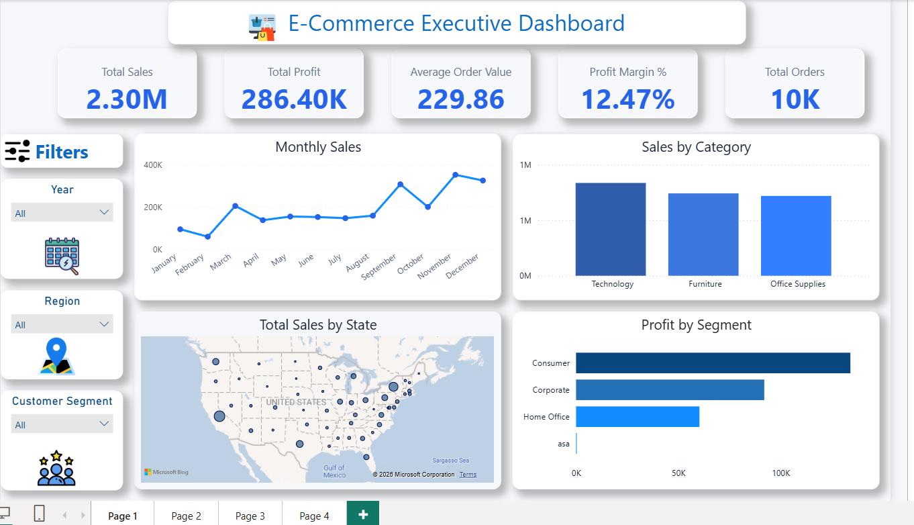
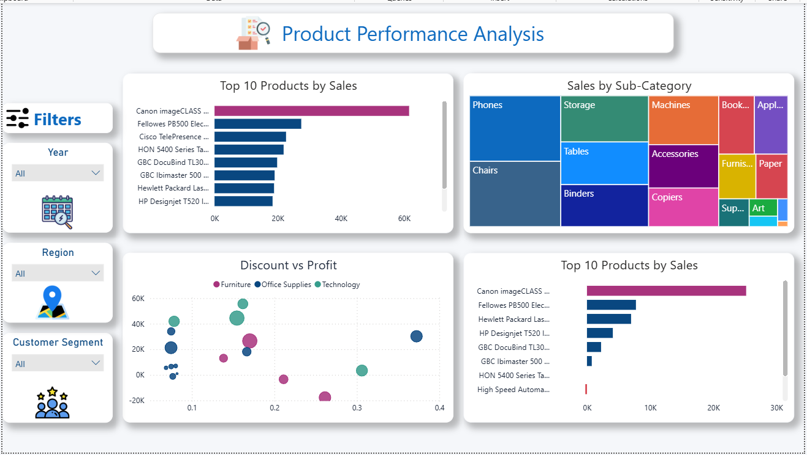
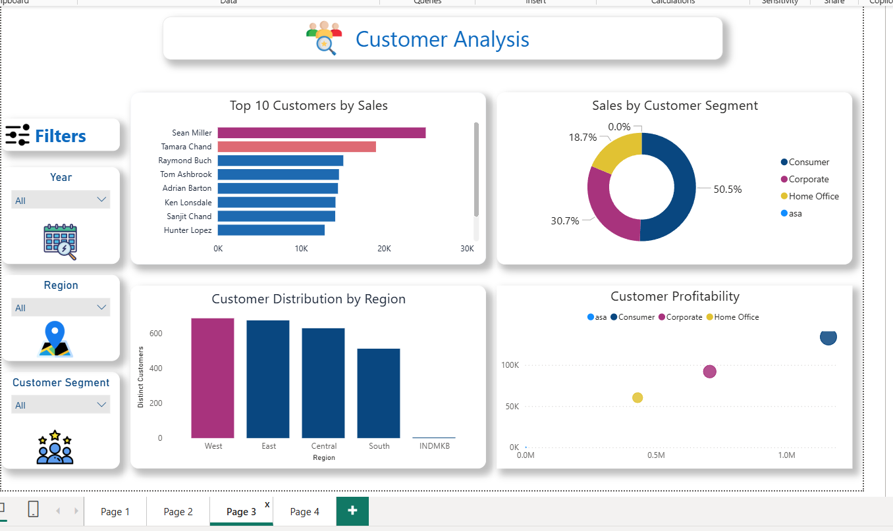
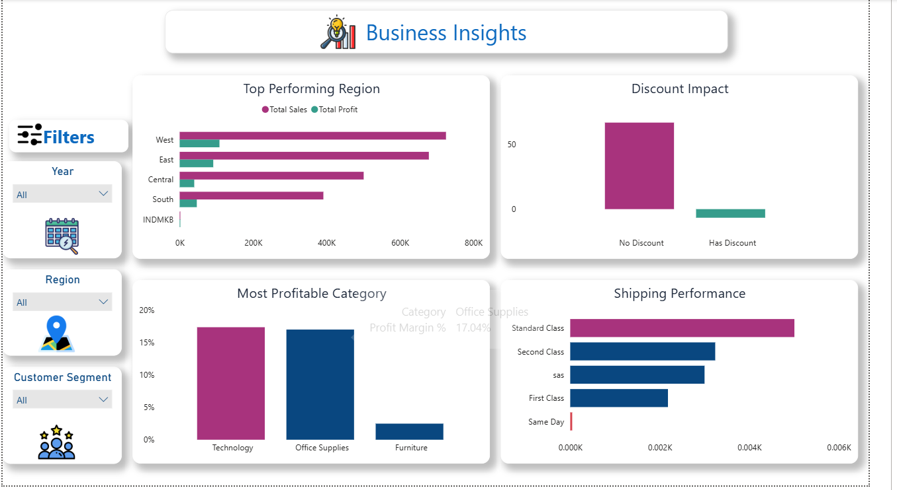

# 📊 Superstore Sales Analytics & High Profit Prediction

<p align="center">

**End-to-End Business Intelligence & Machine Learning Project**

Python • SQL Server • Power BI • Scikit-learn

</p>

---

# 📑 Table of Contents

* Project Overview
* Project Objectives
* Technology Stack
* Project Architecture
* Project Workflow
* Dataset
* SQL Data Warehouse
* Star Schema
* Power BI Dashboard
* Machine Learning
* Model Performance
* Project Structure
* Installation
* How to Run
* Key Results
* Future Improvements
* Author

---

# 📌 Project Overview

This project demonstrates a complete **Business Intelligence and Machine Learning pipeline** built using the Superstore dataset.

The project starts with raw sales data, performs data cleaning and feature engineering using Python, loads the transformed data into SQL Server using an ETL pipeline, builds a Star Schema data warehouse, creates an interactive Power BI dashboard, and finally trains a Machine Learning model to predict whether an order will generate high profit.

The goal of this project is to simulate a real-world Business Intelligence workflow while combining traditional data analytics with predictive analytics.

---

# 🎯 Project Objectives

* Analyze sales performance
* Build a complete ETL pipeline
* Create a SQL Server data warehouse
* Design a Star Schema
* Build professional Power BI dashboards
* Extract business insights
* Train a Machine Learning model
* Predict High Profit orders

---

# 🛠 Technology Stack

| Technology   | Purpose                             |
| ------------ | ----------------------------------- |
| Python       | Data Cleaning & Feature Engineering |
| Pandas       | Data Processing                     |
| NumPy        | Numerical Operations                |
| SQL Server   | Data Warehouse                      |
| SQL          | Data Modeling & Analysis            |
| Power BI     | Dashboard & Visualization           |
| Scikit-Learn | Machine Learning                    |
| Joblib       | Model Saving                        |

---

# 🏗 Project Architecture

```text
Raw Dataset
      │
      ▼
Python Data Cleaning
      │
      ▼
Feature Engineering
      │
      ▼
ETL Pipeline
      │
      ▼
SQL Server
      │
      ▼
Star Schema
      │
      ▼
SQL Views
      │
      ▼
Power BI Dashboard
      │
      ▼
Machine Learning Prediction
```

---

# 🔄 Project Workflow

## 1. Data Understanding

* Dataset inspection
* Missing values analysis
* Data types review
* Initial exploration

---

## 2. Data Cleaning

Performed several preprocessing steps including:

* Handling missing values
* Removing inconsistencies
* Renaming columns
* Formatting dates
* Standardizing values

---

## 3. Feature Engineering

New features created:

* OrderYear
* OrderMonth
* OrderMonthName
* OrderQuarter
* OrderDay
* OrderWeekday
* ShippingDays
* ProfitMargin
* HasDiscount
* HighProfit
* OrderSize

---

## 4. ETL Pipeline

The cleaned dataset is automatically loaded into SQL Server.

Steps:

* Read processed data
* Convert data types
* Create SQL table
* Insert records
* Verify successful loading

---

# 📁 Dataset

The dataset used in this project is the well-known **Superstore Sales Dataset**, containing order-level records including customer, product, location, shipping, sales, and profit information.

Raw and processed versions of the dataset are organized under the `Dataset/` folder in this repository.

---

# 🗄 SQL Data Warehouse

The project implements a Star Schema consisting of:

### Fact Table

* FactSales

### Dimension Tables

* DimCustomer
* DimProduct
* DimLocation
* DimDate
* DimShipMode

---

# ⭐ Star Schema

```text
                 DimDate
                    │
                    │
DimCustomer ── FactSales ── DimProduct
                    │
                    │
          DimLocation
                    │
                    │
             DimShipMode
```

---

# 📈 SQL Analysis

Implemented SQL scripts for:

* Creating tables
* Building Star Schema
* Creating analytical views
* KPI calculations
* Business queries

---

# 📊 Power BI Dashboard

The dashboard consists of four interactive pages.

---

## Page 1 — Executive Dashboard

Features:

* KPI Cards
* Monthly Sales Trend
* Sales by Category
* Sales by State
* Profit by Segment
* Interactive Filters

---

## Page 2 — Product Performance

Features:

* Top Products by Sales
* Sales by Sub-Category
* Discount vs Profit
* Top Products by Profit

---

## Page 3 — Customer Analysis

Features:

* Top Customers
* Sales by Segment
* Customer Distribution
* Customer Profitability

---

## Page 4 — Business Insights

Features:

* Top Performing Regions
* Discount Impact
* Most Profitable Categories
* Shipping Performance
* Business Insights

---

# 🖼 Dashboard Preview

## Executive Dashboard


## Product Performance


## Customer Analysis


## Business Insights


---

# 🤖 Machine Learning

Objective:

Predict whether an order will generate **High Profit**.

Target Variable:

```
HighProfit
```

Classification Models Tested:

* Logistic Regression
* Decision Tree
* Random Forest
* Gradient Boosting

---

# 📊 Model Performance

| Model               | Accuracy  |
| ------------------- | --------- |
| Decision Tree       | **92.4%** |
| Gradient Boosting   | 91.6%     |
| Random Forest       | 90.6%     |
| Logistic Regression | 81.8%     |

Selected Model:

**Decision Tree Classifier**

---

# 📈 Evaluation Metrics

The selected model was evaluated using:

* Accuracy
* Precision
* Recall
* F1-Score
* Confusion Matrix

---

# 📂 Project Structure

```text
E-Commerce-Marketplace-Analysis/

│
├── README.md
├── requirements.txt
├── .gitignore
│
├── Dataset/
│
├── Documentation/
│
├── PowerBI/
│
├── Python/
│
├── Report/
│   └── Images/
│
└── SQL/
```

---

# ⚙ Installation

Clone the repository

```bash
git clone https://github.com/MohammedAhmed-Ai/E-Commerce-Marketplace-Analysis.git
```

Move to project directory

```bash
cd E-Commerce-Marketplace-Analysis
```

Install dependencies

```bash
pip install -r requirements.txt
```

---

# ▶ Running the Project

Run the notebooks in the following order:

1. Data Understanding
2. Data Cleaning
3. Feature Engineering
4. KPI Analysis
5. High Profit Prediction
6. Load to SQL Server

Finally, open the Power BI dashboard.

---

# 📌 Key Results

* Built an end-to-end BI pipeline.
* Designed a Star Schema in SQL Server.
* Developed four interactive Power BI dashboard pages.
* Implemented ETL from Python to SQL Server.
* Built a Machine Learning model with **92.4% accuracy**.
* Generated business insights through SQL and Power BI.

---

# 🚀 Future Improvements

Possible future enhancements include:

* Deploy the ML model using Streamlit or Flask.
* Connect Power BI to a live SQL Server database.
* Schedule automated ETL refreshes.
* Deploy the solution to Azure or AWS.
* Add advanced forecasting models.

---

# 👨‍💻 Author

**Mohamed**

AI Engineer | Machine Learning | Data Analytics | Business Intelligence

---

# ⭐ If you found this project useful

Please consider giving it a ⭐ on GitHub.
